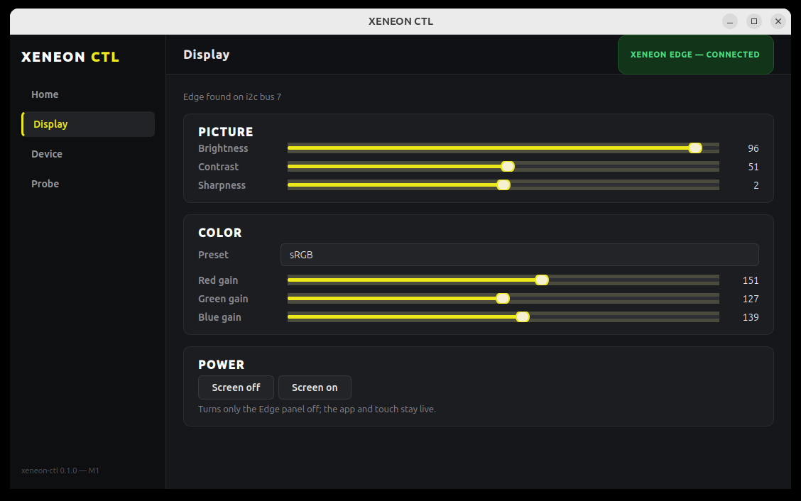
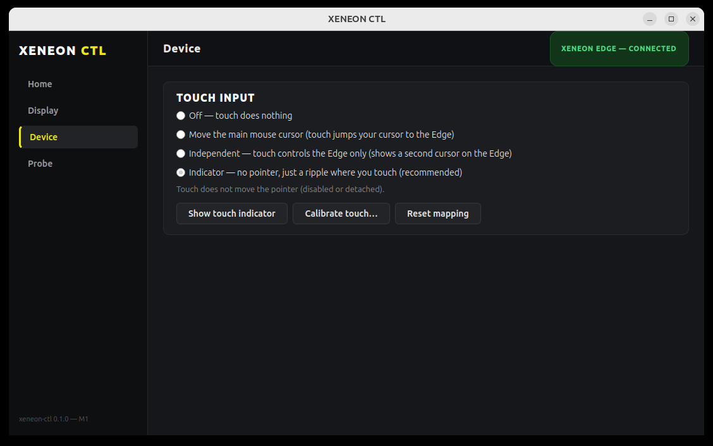
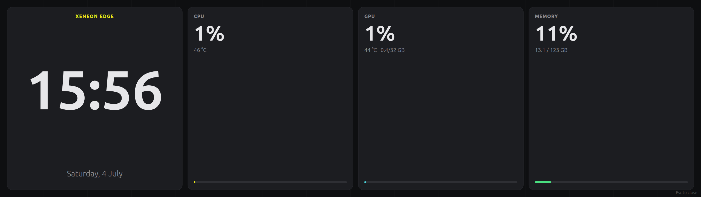

# xeneon-ctl

**Native Linux control for the CORSAIR XENEON EDGE 14.5" LCD touchscreen. No iCUE, no Windows, no cloud.**

CORSAIR ships the [XENEON EDGE](https://www.corsair.com/us/en/p/monitors/cc-9011337-ww/corsair-xeneon-edge-14-5-lcd-touchscreen-atomic-purple-cc-9011337-ww) with software (iCUE) that runs only on Windows. On Linux you get a screen and a touch panel, but no brightness control, no color presets, no touch mapping, and no way to talk to the device at all. iCUE does not run under Wine (its installer needs WinRT and it depends on a Windows kernel driver), so Linux owners were stuck.

I bought the Edge, plugged it into my Linux desktop, and there was nothing. So I built the missing piece myself. `xeneon-ctl` is a clean, native Qt6 application that gives Linux users real control over the Edge: picture settings over DDC/CI, a reverse engineered path into the device's own USB HID protocol, and a proper touchscreen experience (calibration, independent pointer, and a touch ripple indicator) that Linux has never had for this panel.

This is free and open source under the GPL-3.0. If you own a Xeneon Edge and run Linux, this is for you.



## Why this exists

- **CORSAIR Xeneon Edge has zero official Linux support.** iCUE is Windows only.
- **Wine does not help.** The modern iCUE installer crashes on WinRT, and even a forced install cannot reach the hardware because iCUE relies on a Windows kernel driver (CorsairLLAccess) that has no Wine equivalent.
- **The Edge is a great Linux second screen** once you can actually configure it: a 2560x720 ultrawide strip with a 5 point capacitive touchscreen, perfect for system dashboards, sim racing telemetry, media controls, or a Conky panel.

`xeneon-ctl` closes that gap with code written from scratch for Linux, not a port and not a wrapper.

## Features

### Picture control over DDC/CI
Everything a monitor OSD exposes, from software:

- Brightness, contrast, and sharpness sliders with live readback
- Color presets (sRGB, native, 5000K, 6500K, 7500K, 9300K, user)
- Per channel red, green, and blue gain
- Screen power off and on (blank just the Edge panel, the app and touch stay live)

Built on `ddcutil`, so it uses the exact same DDC/CI channel the monitor already understands. No kernel modules, no root daemon.

### A proper touchscreen experience
The Edge's touch panel is a standard USB HID digitizer, but out of the box on X11 it maps across your whole desktop and fights your main cursor. `xeneon-ctl` gives you four clear modes:



- **Off**: touch does nothing.
- **Move the main cursor**: classic behavior, touch drives your system pointer.
- **Independent**: the Edge gets its own X11 pointer, so touching it never yanks your main mouse away.
- **Indicator (recommended)**: the touchscreen drives no pointer at all. A transparent overlay draws a clean ripple exactly where you touch, so you get visual feedback with zero cursor clutter.

Plus a built in **touch calibration** routine (tap five targets, it solves the transformation matrix and applies it) and a **touch indicator overlay** for testing alignment.

### Direct access to the device HID protocol
The Edge speaks CORSAIR's modern "Bragi" / Protocol V2 over a vendor HID interface (`0xFF1B` usage page, 64 byte reports). This project documents that protocol from safe, read first reverse engineering and open source cross referencing. See [PROTOCOL.md](PROTOCOL.md).

- Every HID write is gated behind an explicit confirmation dialog that shows the exact bytes before anything is sent.
- Every transfer is logged to `~/.local/share/xeneon-ctl/hid.log` for full transparency.
- The read only "Probe" console decodes the device report descriptor and reads device info directly over HID. On my unit that returns `SM32,01,SC,SQ,Coruscant LCD,V1.00.20` (firmware V1.00.20, internal codename "Coruscant LCD").

### A system dashboard on the Edge
Turn the Edge into a glanceable status panel. One click renders a fullscreen dashboard on the touchscreen with a large clock and live CPU, GPU, and memory tiles, updated every second.



- Clock and date, with a big readable face sized for the 2560x720 panel
- CPU load and temperature (from `/proc/stat` and hwmon)
- GPU utilization, temperature, and memory (from `nvidia-smi`)
- Memory used and total
- Accent-colored usage bars, dark theme, Esc to close

### A dark, native interface
A clean Qt6 Widgets UI with a dark theme, laid out for quick access. No Electron, no web stack, no background telemetry.

## Supported hardware

| Item | Value |
|------|-------|
| Device | CORSAIR XENEON EDGE 14.5" LCD touchscreen |
| USB ID | `1b1c:1d0d` |
| Display | DisplayPort, 2560x720 (works as a standard monitor) |
| Touch | USB HID digitizer, 5 point capacitive |
| Tested on | Ubuntu 24.04, X11, GNOME, Qt 6.4 |

The architecture keeps room for more CORSAIR devices, but the Edge is the focus today.

## Install

### Dependencies (Ubuntu / Debian)

```bash
sudo apt install build-essential cmake qt6-base-dev libhidapi-dev \
                 libx11-dev libxi-dev ddcutil
```

### Build

```bash
git clone https://github.com/aabdelghani/corsair-xeneon-edge-linux.git
cd corsair-xeneon-edge-linux
cmake -B build
cmake --build build -j
```

### Grant HID access (one time)

The device HID node is root only by default. Install the included udev rule so your user can reach it:

```bash
sudo cp udev/60-corsair-xeneon.rules /etc/udev/rules.d/
sudo udevadm control --reload && sudo udevadm trigger
```

You also need to be in the `i2c` group for DDC/CI:

```bash
sudo usermod -aG i2c "$USER"   # then log out and back in
```

### Run

```bash
./build/xeneon-edge     # the GUI
./build/xeneonctl list  # quick CLI status
ctest --test-dir build  # unit tests
```

## How it works

`xeneon-ctl` is layered so the low level pieces stay small and testable:

```
src/proto/       Bragi HID report framing (no dependencies, unit tested)
src/transport/   hidapi enumeration and IO, read only recon
src/core/        DDC client, HID write gate, touch control, device facade
src/x11/         XInput2 raw touch reader for the ripple indicator
src/ui/          Qt6 dark interface: Display, Device, Probe pages and overlays
src/cli/         xeneonctl command line tool
```

- **DDC/CI** goes through `ddcutil` via an async, debounced, serialized queue so slider drags stay smooth and never pile up.
- **HID writes** all pass through a single `WriteGate` that requires confirmation and logs every byte.
- **Touch modes** are built on `xinput` device reattachment and the X11 multi pointer (XI2) extension.
- **The ripple indicator** floats the touchscreen (so it drives no cursor), reads raw touch events over its own XInput2 connection, and paints ripples on a transparent, always on top overlay pinned to the Edge.

## Safety and honesty

This project treats your hardware with respect:

- No firmware flashing. Ever.
- No blind writes. The first and every HID write shows you the exact packet and asks first.
- Protocol facts are re-implemented from public sources (OpenRGB, OpenLinkHub, liquidctl) and from safe reads of the device. No vendor code is copied.
- Full logs of every device transfer.

## Roadmap

- Saved profiles and restore on login
- Tray icon and autostart, so the Indicator touch mode and DDC settings survive a reboot
- More of the HID feature surface as the protocol map grows
- Customizable dashboard tiles and layouts

## Credits and license

Created by [Ahmed Abdelghany](https://github.com/aabdelghani) because CORSAIR does not support the Xeneon Edge on Linux and someone had to.

Licensed under **GPL-3.0**. Protocol knowledge cross referenced from the excellent [OpenRGB](https://gitlab.com/CalcProgrammer1/OpenRGB) and [OpenLinkHub](https://github.com/jurkovic-nikola/OpenLinkHub) projects.

Not affiliated with or endorsed by CORSAIR. XENEON and iCUE are trademarks of their respective owners.

## Keywords

Corsair Xeneon Edge Linux, Xeneon Edge driver Linux, iCUE alternative Linux, Corsair Linux touchscreen, Xeneon Edge Ubuntu, Corsair LCD Linux control, ddcutil Xeneon, Xeneon Edge calibration, Corsair Bragi protocol Linux, 1b1c:1d0d Linux.
